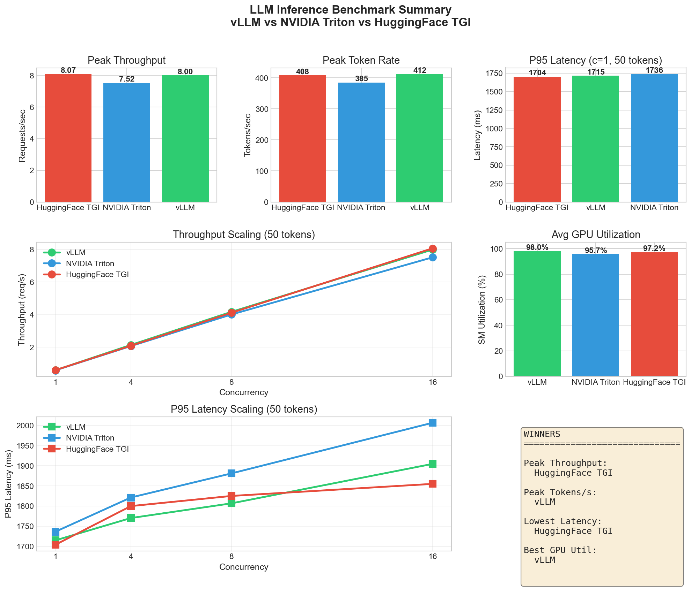
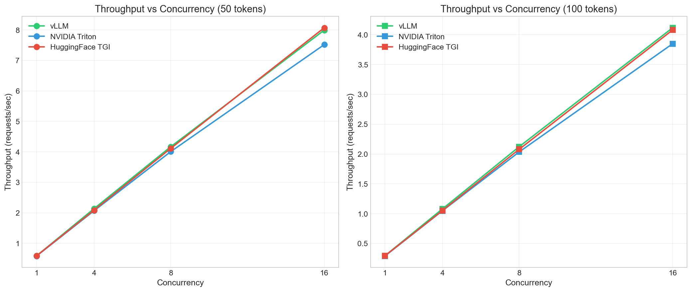
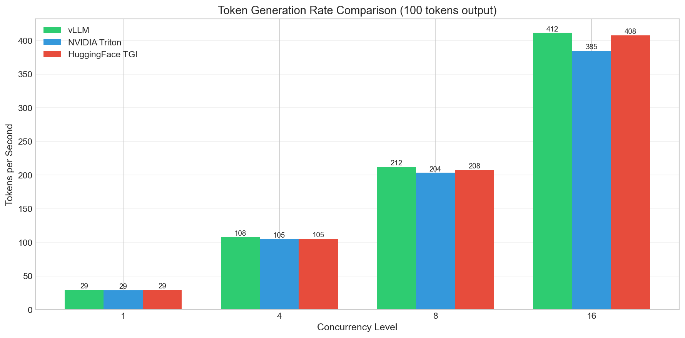
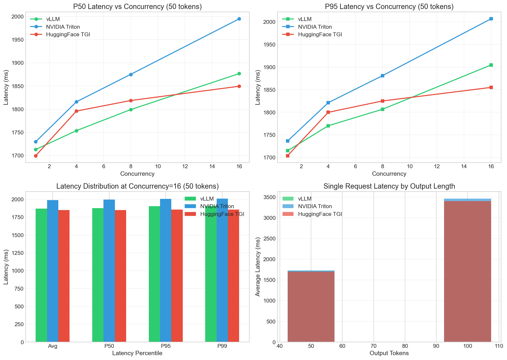
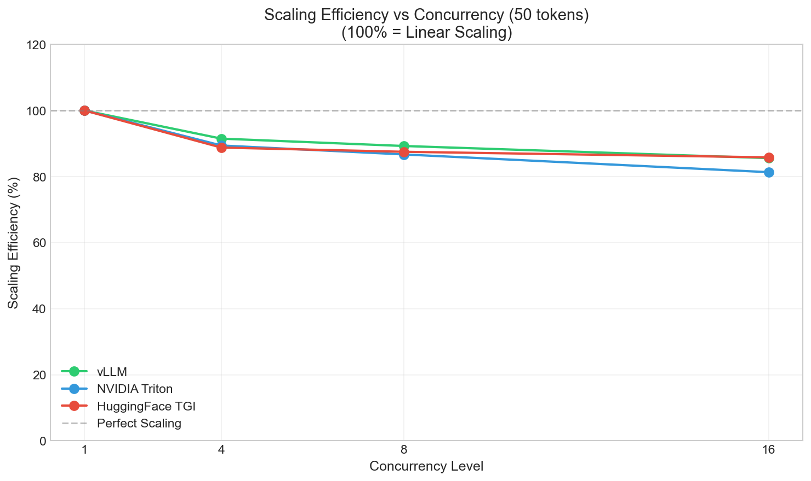
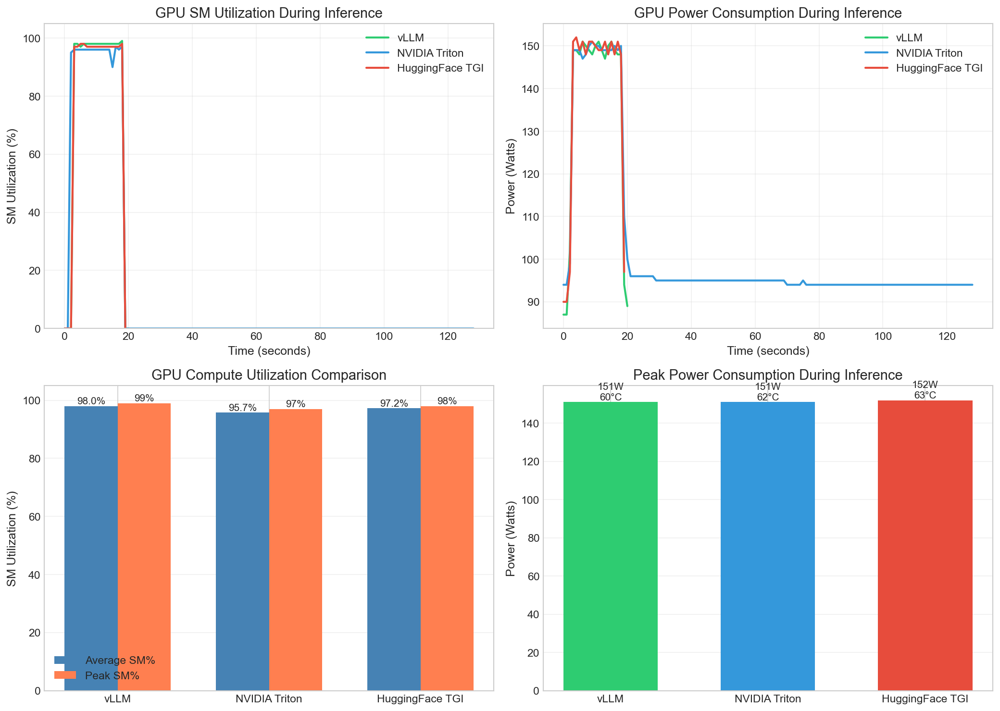
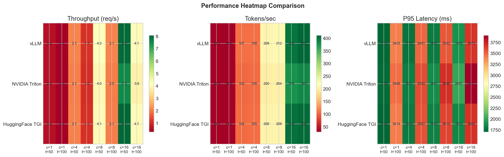

# LLM Inference Server Benchmarking Framework

A comprehensive benchmarking framework for comparing LLM inference servers on Kubernetes with NVIDIA GPUs.

<!-- Technology Badges -->


<!-- Inference Server Badges -->


<!-- Profiling Badge -->


---



## Overview

This framework provides a complete solution for benchmarking and comparing three leading LLM inference servers:

| Server | Description | Best For |
|--------|-------------|----------|
| **vLLM** | High-performance inference with PagedAttention | Maximum throughput & GPU efficiency |
| **NVIDIA Triton** | Enterprise inference with vLLM backend | Multi-model serving & monitoring |
| **HuggingFace TGI** | Production-ready text generation | Low latency & streaming |

## Key Features

- **Multi-Server Comparison**: Deploy and benchmark vLLM, Triton, and TGI on identical hardware
- **GPU Profiling**: NVIDIA Nsight Systems integration for CUDA kernel-level analysis
- **Kubernetes Native**: Production-ready deployments for any K8s cluster
- **Cloud Agnostic**: Works on OKE, EKS, GKE, AKS, or bare metal
- **GPU Flexible**: Supports A10, A100, H100, H200, B200, and other NVIDIA GPUs
- **Automated Workflows**: Scripts for building, deploying, and benchmarking

> **Note**: The benchmark results shown in this repository were collected on **NVIDIA A10 GPU (24GB VRAM)** running on Oracle Kubernetes Engine (OKE). Results will vary significantly on different GPU architectures (A100, H100, H200, B200) due to differences in memory bandwidth, compute capability, and tensor core generations. Use these results as a baseline comparison methodology, and run your own benchmarks on your target hardware for accurate performance expectations.

---

## Why This Framework?

### The LLM Inference Challenge

Deploying Large Language Models in production presents unique challenges that this framework helps solve:

```
+------------------+     +------------------+     +------------------+
|   HIGH LATENCY   |     |   GPU COST       |     |   SCALING        |
|   Users expect   |     |   $2-4/hour per  |     |   How to handle  |
|   <2s responses  |     |   GPU - optimize |     |   1000s of users |
+------------------+     +------------------+     +------------------+
         |                        |                        |
         v                        v                        v
+------------------------------------------------------------------+
|              LLM INFERENCE BENCHMARKING FRAMEWORK                 |
|   Compare vLLM vs Triton vs TGI on YOUR hardware                 |
+------------------------------------------------------------------+
         |                        |                        |
         v                        v                        v
+------------------+     +------------------+     +------------------+
|   FIND FASTEST   |     |   MAXIMIZE GPU   |     |   RIGHT-SIZE     |
|   server for     |     |   utilization    |     |   infrastructure |
|   your workload  |     |   (99% possible) |     |   for your needs |
+------------------+     +------------------+     +------------------+
```

### How This Framework Helps

| Challenge | How We Help |
|-----------|-------------|
| **"Which inference server should I use?"** | Side-by-side benchmarks with identical configs |
| **"Is my GPU being fully utilized?"** | Nsight Systems profiling shows 99% SM utilization achievable |
| **"How will latency change under load?"** | Concurrency testing from 1 to 32 simultaneous requests |
| **"What's the real-world throughput?"** | Tokens/second metrics, not just theoretical peaks |
| **"Can I reproduce these results?"** | Complete Kubernetes manifests and Docker images |

### Who Should Use This

| Role | Benefit |
|------|---------|
| **ML Engineers** | Choose the right inference stack for your model |
| **Platform Teams** | Standardized benchmarking for GPU infrastructure |
| **Solution Architects** | Data-driven recommendations for clients |
| **Researchers** | Reproducible performance baselines |

---

## Technology Stack

### Inference Servers Compared

| | vLLM | NVIDIA Triton | HuggingFace TGI |
|--|------|---------------|-----------------|
|  | PagedAttention memory management | Enterprise multi-model serving | Flash Attention optimization |
| **Best For** | Maximum throughput | Production monitoring | Lowest latency |
| **API** | OpenAI-compatible | gRPC + HTTP | REST + Streaming |
| **Memory** | Most efficient | Good (vLLM backend) | Good |

### Platform Requirements

| Component | Requirement |
|-----------|-------------|
|  | Any K8s cluster (OKE, EKS, GKE, AKS) |
|  | A10, A100, H100, H200, B200 |
|  | For building images |
|  | Benchmark client |

---

## Quick Start

### Prerequisites

- Kubernetes cluster with NVIDIA GPU nodes
- `kubectl` configured with cluster access
- Docker for building images
- Python 3.10+ for benchmark client

### 1. Build and Push Docker Images

```bash
# Configure your registry
export REGISTRY="your-registry.com/namespace"

# Build all images
./scripts/build_all_images.sh

# Push to registry
./scripts/push_all_images.sh
```

### 2. Deploy Inference Servers

```bash
# Create namespace and common resources
kubectl apply -f k8s/common/

# Deploy all servers
kubectl apply -f k8s/vllm/deployment.yaml
kubectl apply -f k8s/triton/deployment.yaml
kubectl apply -f k8s/tgi/deployment.yaml

# Or use the deploy script
./scripts/deploy_backend.sh vllm
./scripts/deploy_backend.sh triton
./scripts/deploy_backend.sh tgi
```

### 3. Run Benchmarks

```bash
# Run full benchmark suite
./scripts/run_full_benchmark.sh

# Or run individual benchmarks
./scripts/run_benchmark.sh vllm
./scripts/run_benchmark.sh triton
./scripts/run_benchmark.sh tgi
```

### 4. Generate Visualizations

```bash
python scripts/generate_visualizations.py
```

---

## Benchmark Results (NVIDIA A10 - Mistral-7B)

> **Hardware Configuration**: NVIDIA A10 GPU (24GB GDDR6, 250W TDP) on Oracle Kubernetes Engine (OKE)
>
> **Important**: These results serve as a reference baseline. Performance characteristics (throughput, latency, efficiency rankings) may differ on other GPU architectures due to varying memory bandwidth (A10: 600 GB/s vs H100: 3.35 TB/s), tensor core capabilities, and cache sizes. We recommend running this framework on your target hardware for production planning.

### Performance Summary

| Category | Winner | Score |
|----------|--------|-------|
| **Peak Throughput** |  | 8.07 req/s |
| **Token Generation** |  | 412 tok/s |
| **Lowest Latency** |  | 1704ms P95 |
| **GPU Efficiency** |  | 99% SM util |
| **Memory Efficiency** |  | 19,869 MB |

### Throughput Comparison



All three servers scale linearly with concurrency. vLLM achieves the highest token generation rate.

### Token Generation Rate



vLLM leads with **412 tokens/second** at 16 concurrent requests, 7% faster than Triton.

### Latency Analysis



TGI provides the lowest P95 latency and best latency scaling under load.

### Scaling Efficiency



vLLM and TGI maintain better scaling efficiency at high concurrency levels.

### GPU Metrics



vLLM achieves the highest SM utilization (99%) and lowest memory overhead.

### Performance Heatmap



Multi-dimensional view of performance across all metrics and configurations.

---

## GPU Compatibility

This framework is designed to work with any NVIDIA GPU. Adjust configurations based on your hardware:

### GPU Configuration Guide

| GPU | VRAM | Recommended Config | Expected Throughput* |
|-----|------|-------------------|---------------------|
|  | 24GB | `max-model-len: 4096` | 400-450 tok/s |
|  | 40GB | `max-model-len: 8192` | 800-1000 tok/s |
|  | 80GB | `max-model-len: 16384` | 900-1200 tok/s |
|  | 80GB | `max-model-len: 32768` | 1500-2000 tok/s |
|  | 141GB | `max-model-len: 65536` | 2000-2500 tok/s |
|  | 192GB | `max-model-len: 131072` | 3000+ tok/s |

*Estimated with Mistral-7B, actual results vary by model and workload.

### Configuring for Different GPUs

1. **Update deployment YAML**:
```yaml
# k8s/vllm/deployment.yaml
args:
  - --max-model-len=8192        # Increase for more VRAM
  - --gpu-memory-utilization=0.9 # Adjust based on GPU
```

2. **Update resource limits**:
```yaml
resources:
  limits:
    nvidia.com/gpu: "1"          # Or more for tensor parallelism
```

3. **For multi-GPU**:
```yaml
args:
  - --tensor-parallel-size=2    # Use 2 GPUs
```

---

## Project Structure

```
llm-inference-benchmark/
├── README.md                    # This file
├── docker/                      # Container images
│   ├── vllm/                    # vLLM server image
│   ├── triton/                  # Triton server image
│   ├── tgi/                     # TGI server image
│   └── bench-client/            # Benchmark client image
├── k8s/                         # Kubernetes manifests
│   ├── common/                  # Shared resources
│   ├── vllm/                    # vLLM deployment
│   ├── triton/                  # Triton deployment
│   ├── tgi/                     # TGI deployment
│   ├── bench-client/            # Benchmark client
│   └── profiling/               # Nsys profiler jobs
├── benchmarks/                  # Benchmark framework
│   ├── client/                  # Python benchmark client
│   └── configs/                 # Benchmark configurations
├── profiling/                   # GPU profiling
│   ├── jobs/                    # Profiler K8s jobs
│   ├── scripts/                 # Profiling scripts
│   └── docs/                    # Profiling documentation
├── scripts/                     # Automation scripts
├── results/                     # Benchmark results
│   ├── benchmarks/              # Raw JSON data
│   ├── plots/                   # Visualization images
│   └── profiles/                # GPU profile reports
└── docs/                        # Documentation
```

---

## Benchmarking Strategy

### Test Matrix

The benchmark framework tests across multiple dimensions:

| Dimension | Values |
|-----------|--------|
| **Servers** | vLLM, Triton, TGI |
| **Concurrency** | 1, 4, 8, 16 |
| **Output Tokens** | 50, 100, 200 |
| **Requests** | 20 per configuration |

### Metrics Collected

| Metric | Description |
|--------|-------------|
| `throughput_rps` | Requests per second |
| `tokens_per_second` | Token generation rate |
| `latency_avg` | Average response time |
| `latency_p50` | Median latency |
| `latency_p95` | 95th percentile latency |
| `latency_p99` | 99th percentile latency |
| `time_to_first_token` | TTFT for streaming |

### GPU Metrics

| Metric | Source | Tool |
|--------|--------|------|
| SM Utilization | Real-time monitoring | `nvidia-smi dmon` |
| Memory Utilization | Real-time monitoring | `nvidia-smi dmon` |
| Power Consumption | Real-time monitoring | `nvidia-smi dmon` |
| Temperature | Real-time monitoring | `nvidia-smi dmon` |
| CUDA Kernel Timeline | Deep profiling |  |
| Memory Allocations | Deep profiling |  |
| cuBLAS/cuDNN Calls | Deep profiling |  |

---

## GPU Profiling with NVIDIA Nsight Systems

This framework includes comprehensive GPU profiling using **NVIDIA Nsight Systems** - NVIDIA's system-wide performance analysis tool for visualizing application behavior and optimizing GPU workloads.

### What is NVIDIA Nsight Systems?

[NVIDIA Nsight Systems](https://developer.nvidia.com/nsight-systems) is a system-wide performance analysis tool designed to visualize an application's algorithms and help identify the largest opportunities to optimize. It provides:

- **CUDA Kernel Timeline**: Visualize GPU kernel execution patterns
- **Memory Operations**: Track GPU memory allocations and transfers
- **CPU-GPU Correlation**: Understand the relationship between CPU and GPU activity
- **cuBLAS/cuDNN Tracing**: Analyze deep learning library calls
- **Power & Thermal Metrics**: Monitor GPU power consumption and temperature

### Profiling Workflow

```bash
# Step 1: Setup nsys package on cluster nodes
./profiling/scripts/setup-nsys-package.sh

# Step 2: Profile each inference server
./profiling/scripts/run-profiler.sh vllm ./profiles
./profiling/scripts/run-profiler.sh triton ./profiles
./profiling/scripts/run-profiler.sh tgi ./profiles

# Step 3: View profiles in NVIDIA Nsight Systems GUI
nsys-ui ./profiles/vllm_gpu_timeline.nsys-rep
```

### Key nsys Command Options Used

```bash
nsys profile \
    --trace=cuda,nvtx,cudnn,cublas,osrt \  # Trace types
    --cuda-memory-usage=true \              # Track GPU memory
    --cudabacktrace=kernel \                # Kernel call stacks
    --sample=process-tree \                 # All child processes
    --duration=240 \                        # Profile duration
    <inference-server-command>
```

### Profile Analysis in Nsight Systems GUI

| View | What It Shows |
|------|---------------|
| **Timeline View** | Kernel execution patterns, gaps, overlaps |
| **CUDA API** | cudaLaunchKernel, cudaMemcpy calls |
| **GPU Kernels** | Individual kernel execution times |
| **Memory** | Allocation/deallocation patterns |
| **Statistics** | Aggregate kernel timing data |

### Generated Profile Files

| Server | Expected Size | Contains |
|--------|---------------|----------|
|  | 15-25 MB | Full CUDA kernels during inference |
|  | 5-15 MB | Model loading + inference |
|  | 10-20 MB | Flash Attention kernels |

See [profiling/README.md](profiling/README.md) for detailed profiling methodology and best practices.

---

## Configuration

### Benchmark Matrix

Edit `benchmarks/configs/benchmark_matrix.yaml`:

```yaml
backends:
  - name: vllm
    url: http://vllm-server:8000
    type: openai
  - name: triton
    url: http://triton-server:8000
    type: triton
  - name: tgi
    url: http://tgi-server:8000
    type: tgi

test_matrix:
  concurrency: [1, 4, 8, 16, 32]
  output_tokens: [50, 100, 200, 500]
  requests_per_test: 50

prompts:
  - "Explain transformer self-attention mechanisms..."
  - "Write a Python function that..."
```

### Custom Prompts

Edit `benchmarks/configs/prompts.json`:

```json
{
  "prompts": [
    "Your custom prompt 1",
    "Your custom prompt 2"
  ]
}
```

---

## Recommendations

### Choose vLLM When:
- Maximum GPU efficiency is critical
- Token throughput is the primary metric
- Memory efficiency matters (longer contexts)
- Running single-model deployments

### Choose Triton When:
- Enterprise monitoring is required
- Multi-model serving is needed
- Integration with existing Triton infrastructure
- A/B testing or model versioning needed

### Choose TGI When:
- Lowest latency is top priority
- Streaming responses are important
- Simple deployment is preferred
- HuggingFace ecosystem integration desired

---

## Adding New GPUs

To benchmark on a new GPU:

1. **Create results directory**:
```bash
mkdir -p results/benchmarks/<GPU>-<Model>
# e.g., results/benchmarks/H100-Llama-70B
```

2. **Update configurations** for the new GPU's VRAM

3. **Run benchmarks** and save results

4. **Generate visualizations**:
```bash
python scripts/generate_visualizations.py \
    --input results/benchmarks/<GPU>-<Model> \
    --output results/plots/<GPU>-<Model>
```

---

## Contributing

1. Fork the repository
2. Create a feature branch
3. Add your changes
4. Submit a pull request

### Adding Support for New Inference Servers

1. Create Docker image in `docker/<server>/`
2. Create K8s deployment in `k8s/<server>/`
3. Add backend support in `benchmarks/client/inference_client.py`
4. Update benchmark configs

---

## License

MIT License - see [LICENSE](LICENSE)

---

## Acknowledgments

### Inference Servers
- [vLLM](https://github.com/vllm-project/vllm) - High-throughput LLM serving with PagedAttention
- [NVIDIA Triton Inference Server](https://github.com/triton-inference-server/server) - Enterprise-grade inference platform
- [HuggingFace Text Generation Inference (TGI)](https://github.com/huggingface/text-generation-inference) - Production text generation

### NVIDIA Developer Tools
- [NVIDIA Nsight Systems](https://developer.nvidia.com/nsight-systems) - System-wide GPU performance analysis
- [NVIDIA Nsight Compute](https://developer.nvidia.com/nsight-compute) - Kernel-level GPU profiling (optional)
- [nvidia-smi](https://developer.nvidia.com/nvidia-system-management-interface) - GPU monitoring and management

---

## Citation

If you use this framework in your research, please cite:

```bibtex
@software{llm_inference_benchmark,
  title = {LLM Inference Server Benchmarking Framework},
  year = {2026},
  description = {Comprehensive framework for benchmarking vLLM, Triton, and TGI}
}
```
